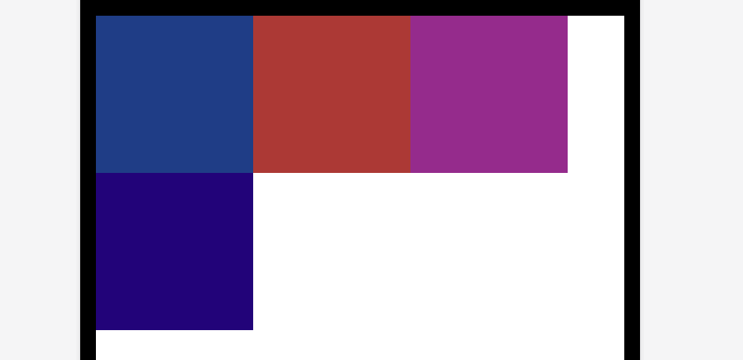
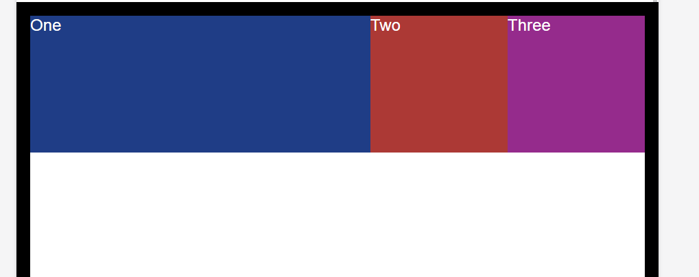
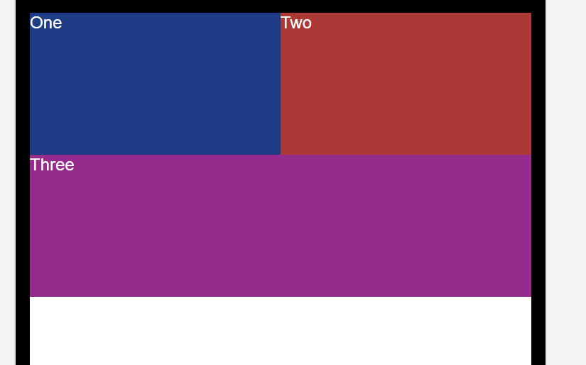
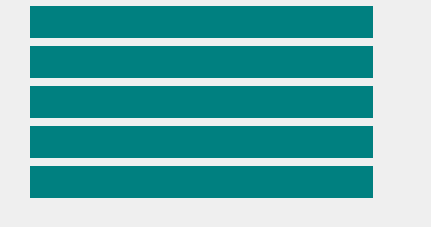
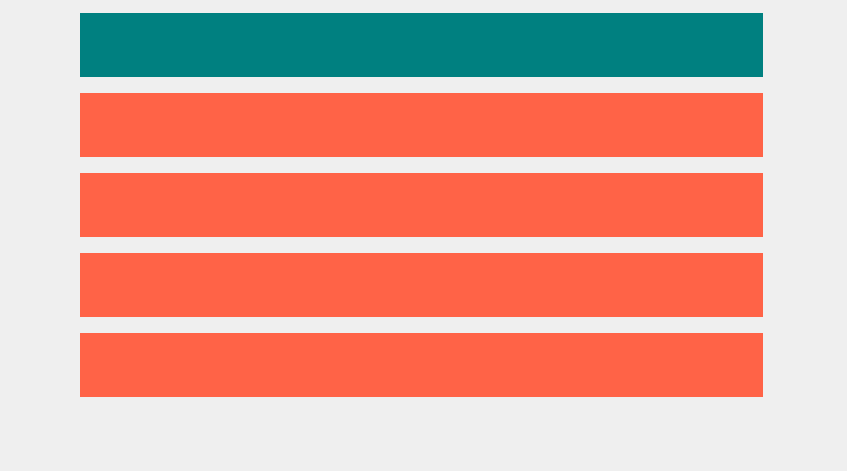
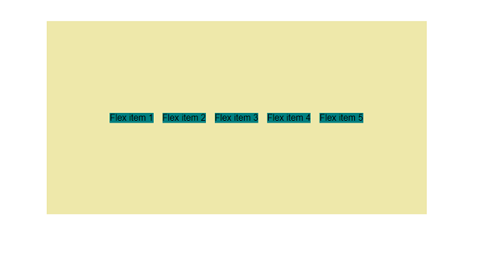
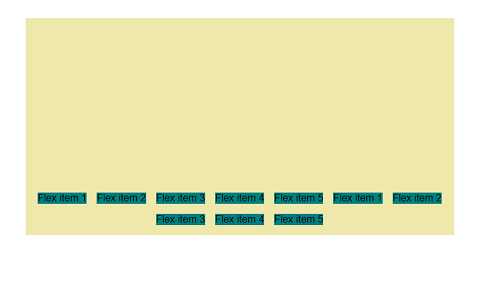
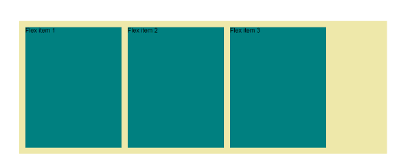
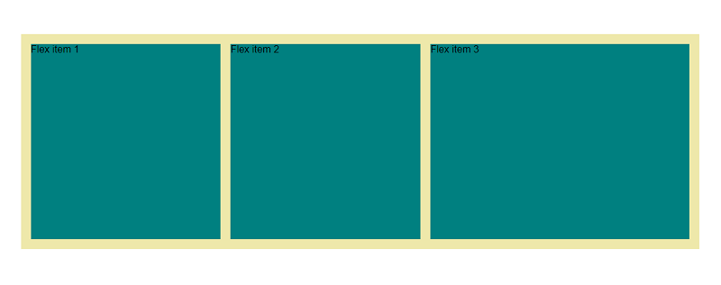

# CSS FLEXBOX - FLEX WRAP
---

* Basic html, css setup files for learning flex wrap and demonstrating..
```html
<div class="parent">
    <div class="child child__1"></div>
    <div class="child child__2"></div>
    <div class="child child__3"></div>
    <div class="child child__4"></div>
</div>
```
```css
.parent{
    height: 100vh;
    border: 20px solid black;
    display: flex;
}

.child{
    width: 200px;
    height: 200px;
}

.child__1{
    background: rgb(31, 61, 134);
}
.child__2{
    background: rgb(172, 57, 53);
}

.child__3{
    background: rgb(149, 43, 140);
}

.child__4{
    background: rgb(34, 3, 121);
}
```


if the flex wrap is set using `flex-wrap: wrap;`, on parent. when shrinks the child items doesn't
try to adjust on but moves down like,


1. How can one adjust contents individually?

- Use the `align-content` property, for **vertical alignment** of individual items,
```css
.parent{
    height: 100vh;
    border: 20px solid black;
    display: flex;
    align-content: flex-start;
}
```


there is also `center`, `space-around`..etc options.\

2. How to align text in the flexbox inline?
* USe the `align-items: baseline;`, in the parent.

3. What is `flex-flow`?
It is a shorthand property for the parent, that can specify the flex direction, wrapping setting at same time\
eg:  instead of setting, `flex-direction: column; flex-wrap: wrap;`
```css
.parent{
    height: 100vh;
    border: 20px solid black;
    display: flex;
    flex-flow: column wrap;
}
```

4. How to gain more control over individual items in flexbox?

* Till now all the properties are applied to parent, for child items there are
  1. `order` (numerical values, change the order of items)\
       Initially every element got an order 0, when we assigning order to child items the lower the number, the prior it gets, eg:
        ```css
        .child__1{
          background: rgb(31, 61, 134);
        }
        .child__2{
          background: rgb(172, 57, 53);
          order: 3;
        }

        .child__3{
          background: rgb(149, 43, 140);
          order: 1;
        }

        .child__4{
          background: rgb(34, 3, 121);
          order: 2;
        }
        ```
        

       See how just changing the order alters the base order, child-1 still stays first because it got the initial order of 0. The higher the number its going to push to last.

  2. flex-grow (numerical, Change the size of each child)
       for eg, we got three children, and
       ```css
        .child__1{
          background: rgb(31, 61, 134);
          /* Give a flex-grow */
          flex-grow: 1;
        }
        .child__2{
          background: rgb(172, 57, 53);
        }

        .child__3{
          background: rgb(149, 43, 140);
        }
        ```
        

        It takes all the space left or available (the empty space), if put `flex-grow: 2` on the second child,

       

       It basically divides the remaining space and first one takes `1/3` part and 2nd child takes `2/3` part,
       and it is responsive, better suited for responsive design.\
       If I give `flex-grow: 1` to all, all items takes up equal space.
  3. flex-shrink (opposite to flex-grow)
  4. flex-basis (defines a basic width for individual item, can use instead of width)

       One can combine this all in a single property, `flex:`, like
       ```css
        .child__1{
          background: rgb(31, 61, 134);
        }
        .child__2{
          background: rgb(172, 57, 53);
          /* specifies flex-grow, flex-shrink, flex-basis (shorthand) */
          flex: 1 0 auto;
        }

        .child__3{
          background: rgb(149, 43, 140);
        }
        ```

       The auto is the default value. The overall default flex value is `flex: 0 1 auto;`, so if it just applies
       `flex: 1`(means `flex-grow: 1`, rest default), the rest is going to get defaulted, to display

        ```css
        .child__1{
           background: rgb(31, 61, 134);
           flex: 1 1 300px;
        }
        .child__2{
           background: rgb(172, 57, 53);
           flex: 1 1 300px;
        }
        .child__3{
           background: rgb(149, 43, 140);
           flex: 1 1 300px;
        }
        ```
        So each element is given a flex grow of 1 and min width of 300px,
        

        So when the viewport width shrinks down and reaches, 3 * 300 = 900px,\
        The last item gets down and takes the whole area,
        

    5. align-self property

        Lets one align the individual items, rather than the global flex arrangement
        ```css
        .child__1{
             background: rgb(31, 61, 134);
         }
         .child__2{
             background: rgb(172, 57, 53);
             align-self: center;
         }
         .child__3{
             background: rgb(149, 43, 140);
             align-self: flex-end;
         }
        ```
        


## Adding Gap between flex items
---
* To adjust the gap between flex items use the `gap` property.
  ```css
  .row{
      display: flex;
      gap: 100px;
  }
  ```
* Creates a space between flex items and does not affects the outside items, but it is relatively new,
don't got all browser support(chrome, firefox, chrome android all supports it)..
* But there is an trick, using a weird selector,
  ```css
  .col + .col {
      margin-left: 100px;
  }
  ```
  It is a combinator selector, ///CSS combinators/\
  Here `+` selects the adjacent sibling, its looking if something comes before it, so the first column got\
  nothing before it.\
  So it select 2 and 3 and adds a margin left to it..

  ## CSS combinators
  ---
  * Adjacent Sibling Selector
  Basic styles and markup.
  ```html
  <body class="first-example">
    <div class="example one"></div>
    <div class="example two"></div>
    <div class="example three"></div>
    <div class="example four"></div>
    <div class="example five"></div>
  </body>
  ```
  ```css
  *, ::before, ::after{
      box-sizing: border-box;
  }

  body{
      margin: 0;
      background: #efefef;
      color: #333;
      font-family: basic-sans, sans-serif;
  }

  .first-example{
      display: block;
  }

  .example{
      padding: 2em;
      width: 50%;
      margin: 1em auto;
      background: teal;
  }
  ```
  

  Using the adjacent selector,
  ```css
  .example + .example{
      background: tomato;
  }
  ```
  

  It looks the first `example`, and looks for any `example` element before it- no, but for the second, third...\
  all got an example `element` just before them, so they gets selected..

  It can be like this also,
  ```css
  div + .example{
      background: tomato;
  }
  ```
  Which one got a `div` before one, or it can go all the way up to,

  It looks only the siblings, not the parent if the `.example` is inside a div it not gets selected.
  ```css
  * + *{
      margin: 1em 0 0;
  }
  ```
  Just mean, select all elements that got some element before it (the very first element not selected), and add a top-bottom margin of 1 em. Its called the **Owl Selector** (First suggested by Heydon Pickering)..

  It is applicable for all elements in a container, and because the margin is only top, it avoids both top and bottom extra spaces and also cz it is in `em`, for large font-sizes like `h2`, `h1` the margin will be higher.

  Also this thing got low specificity, so it can be easily overwrite, for example it creates problems with flex box, we can just restore the margins of a flexbox container by using,
  ```css
  .box > *{
    margin-top: 0;
  }
  ```
  That means, All the direct children of the `box` container.

  ## Comparison and learning from Day 8 solutions
  ---
  1. Always use classes possible, don't chain(descendance) things unnecessarily, like `.container .row h2`, like that give it a class always if possible and do the design.
  2. Use simple custom classes, like for a specific color, use a class and add that class wherever to get that color, same for `text alignment`, absolute centering etc..
  3. Divide a page into `section`s, follow some semantics always, and put scopes for improvement.

## Reducing HTML,
* Moving the row class(that got the `display: flex`), with the container class (`width: 80%`), thereby reducing one div.
* Assigning a single major function to each class.

## Adding hero image
* Adding an image in the hero section.
* Fixing image inside a div.\
  basic responsiveness
  ```css
  img{
    display: block;
    max-width:100%;
  }

## Column width and flexbox
---
* Using the `flex-grow`, properties, if given width of 100% to both hero__text and img div, both gonna occupy the same space,
* But what we need is the text occupy 60% of the width and the image gets 40% constantly.

## DEEP DIVE INTO FLEXBOX
***
&copy; Kevin Powell

1. The `align-items: baseline` useful for the parent nav container, if the children got varying font-sizes..

2. The `align-content` for the parent container.
     * Only works when there is multiple lines of content.
     * eg:
      ```html
      <section class="first-example">
         <div class="example one">Flex item 1</div>
         <div class="example two">Flex item 2</div>
         <div class="example three">Flex item 3</div>
         <div class="example four">Flex item 4</div>
         <div class="example five">Flex item 5</div>
      </section>
      ```
      ```css
       .first-example{
           background: palegoldenrod;
           height: 50vh;
           width: 50vw;
           padding: 0.5em;
           margin: 25vh auto 0;

           display: flex;
           flex-direction: row;
           flex-wrap: nowrap;

           justify-content: center;
           align-items: center;
           /* This will no nothing, there only single line of content */
           align-content: flex-end;
       }

       .example{
           background: teal;
           margin: 0.5em;
       }
      ```

     

    * But if more divs added, and `flex-wrap: wrap`, there willbe multilines and the `aligns-content`\
    overwrites the `align-items`,
    
    * The same values of `justify-content`, exist here too

### `flex-grow` and `flex-shrink` in detail.
---
* Using the same html, with only three boxes, and css set to default flex-grow and flex-shrink
```css
.one{
    /* flex-grow: 0;
    flex-shrink: 1;
    flex-basis: 250px; */
    /* grouped to */
    flex: 0 1 250px;
}

.two{
    flex: 0 1 250px;
}

.three{
    flex: 0 1 250px;
}
```


* Note that the empty space left around cz, of no flex grow values set, if set flex grow values, the item will take the available empty space accordingly as said in the basics.
* If `flex-shrink` is set like these,
```css
.one{
    flex: 1 1 250px;
}

.two{
    flex: 1 1 250px;
}

.three{
    flex: 3 3 250px;
}
```

* What happens is if the screen size larger than (3 * flex-basis = 750px), the third box will grow 3 x faster than, other two (other two will also grow at a smaller rate, to say somewhat exactly, the empty space at a point (width - 750px) is taken at a time and  1/5 of it is occupied by the first two containers, and 3/5 of it is by the last one (which the flex grow is 3).

* When shrinks (display width less than 750px) the exact opposite happens the 3<sup>rd</sup> one shrinks Thrice (flex-shrink: 3) faster than others.


> #### To grab a little more and as a refer to the future, lets create a [managing flex-box codepen](https://codepen.io/akshaych/pen/mdEEQeo) forked from kevins one.
> #### Here is a [flexbox - playground]() that can be used to play with flexbox.