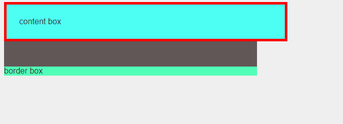

# CONQUERING RESPONSIVE LAYOUTS
---
## Get Better each day.
Thanks to this amazing man: [Kevin Powell](https://www.kevinpowell.co/)


### Introduction
* To blackout solutions(to mark it as a spoiler), use the "||" character to start and end a covered out text\
in Discord.


By default everything is responsive, ie if there is only html and there is no CSS bounded everything is responsive, \
we are the ones adding rules in the form of CSS, which eventually breaks the responsiveness,

So to keep the responsiveness with you, play it wisely, choose each decisions(rules/units) as wise as you can.


## Day 1
***

* Use the `overflow: hidden` wisely on the `parent` elements.
* ### Why Should you avoid using heights.
    * The general idea is it cause more issues than they solve.
    * When there is a fixed height to an element, and the display shrinks to mobile, then a major part of whats inside will be not visible.
    * If you start that fixing with media queries, you need a whole lot of 'em.
    * If you need more background, instead of fixing a height, try to add more padding to it, that makes it nicer.
    * like `padding: 5em` [5em is actually, 16 * 5 = 80px, the default font size is 16px, that is what used for the em unit.]
* ### The `em`s and the `rem` s
    * `1 em` is `16px`, which is the default font size of the html, if you specify font-size in em's, you are using your parents font size as a base and do the stuffs.
      ```html
      <div class="parent">
          <div class="child">
              <p>Lorem, ipsum dolor sit amet consectetur adipisicing elit. Voluptas quae repudiandae asperiores ratione
                  eius ipsam.</p>
          </div>
      </div>
      ```
    * if the "parent" `font-size: 10px` and the child set to
      ```css
      .child p{
          font-size: 2em;
      }
      ```
        Now the p elements have a font size of `2 * 10px = 20px`, ie it is always based on the nearest parent.
        It is compounding
    * `rem`s are invented with fixing the problems with the compounding of `em`s, rem stands for "root em", (em expands to ephemeral unit), it always going to be looking at the roots elements body ie the (`html` font size.)
    * `rem` units are more consistent.
    * It can be used for all padding, margins, width other than just font size.
    * The other properties also behave differently,
        ```css
        .parent{
            font-size: 10px;
        }
        .child p{
            font-size: 2em;

            margin-bottom: 1em;
        }
        ```
        This time the `em` is based on the present font size,(not the very prv. parent font size), ie the bottom margin now will be 20px(2em(base) * 1em),
    * But here also these don't apply for `rem`s, which are always looking at the root- html element,
        ```css
        .child p{
            font-size: 2em;

            margin-bottom: 1rem;
        }
        ```
        Here the margin will be, 1 * 16px = 16px.

    * The `em` gets super useful in many areas for example in case of a button,
        ```css
        .child .btn{
            display: inline-block;
            background: black;
            font-weight: 700;
            letter-spacing: 5px;
            color: white;
            text-transform: uppercase;
            text-decoration: none;
            font-size: 1.6em;

            padding: 1em 3em;
        }
        ```
        Here the padding adapts to the font-size, ie if the font size of the parent decreased, all things that is based on the em will gets affected similarly.

        In short, The `em`'s are more useful where things need to be more adaptive, and use `rem`s if it needs more consistent.
    * When you see in others code the html, font size is set to `62.5%`, what it is - {`10px * 100/ 16` = 62.5}, it is basically setting the root to 10px, and when it is in percentages, it allows more scalability from there too.


## Day 2
***

* ### Don't set font size using `em`s
    If you got a html, which is weird as like in below,
    ```html
    <ul class="main-list"> <!-- font-size: 1.125 -->
      <li>List 1</li>
      <li>List 2</li>
      <li>List 3</li>
      <ul class="sub-list"> <!-- font-size: 1.125 * 1.125 -->
          <li class="items">Lorem ipsum dolor sit amet consectetur.</li>
          <li class="items">Lorem ipsum dolor sit amet consectetur.</li>
          <li class="items">Lorem ipsum dolor sit amet consectetur.</li>
          <ul class="sub-sub-list"> <!-- font-size: 1.125 * 1.125 * 1.125 -->
              <li class="super-childs">Lorem ipsum dolor sit amet consectetur.</li>
              <li class="super-childs">Lorem ipsum dolor sit amet consectetur.</li>
              <li class="super-childs">Lorem ipsum dolor sit amet consectetur.</li>
          </ul>
        </ul>
    </ul>
    ```

    And if you set the font size using em like this,
    ```css
    ul, li{
        font-size = 1.125em;
    }
    ```

    It is gonna compound as in the comments, so stick to `em` only to add paddings and margins to
    whichever element, need it.

  ### Using `max-width`
  ---
    * Can use a combination of min-width and max-width to simply tackle awkward growing of things.
    * To control the text length, can use the max-width property with the ch unit\
    ```css
    p{
        max-width: 45ch; /* Limits the paragraph length to 45 characters */
    }
    ```

  ### Using VS code emmet to wrap up a div/html element.
  * Use the `shift + ctrl + p` to go to command pallette, then search for the `emmet`, pick the\
  `wrap with abbreviation`, then enter the element(with class if needed eg: `div.container`).

  * Limiting a container Size.
  ```css
  .container{
    width: 80%;     /* Actual Width */
    max-width: 750px;   /* max-width */
    margin: 0 auto;    /* Align horizontally */
  }
  ```
### DAY 5 project outs
---
1. Do only this in the root, `body` margin can be set to zero after
```css
*, *::before, *::after {
  box-sizing: border-box;
}
```
2. Adding `padding` to the inner content. your method is to make absolute position to the children, it is\
an enemy to responsive design. The approach is to add padding top and bottom, make the child container width in\
%s, and use a `max-width` always.
3. Thinking in a responsive way, the more organized things are, the more easy to control them, simply more divs
for each particular element, it is easy to place or control them (for eg, adding padding to them makes good spacing from the relatives), so adding an extra container div for getting more control.
4. Using the BEM(Block Element Modifier) naming convention, when it comes to child elements, use `__` to represent their names.So it can be easily identified which one is child element, of which one.
5. For buttons to get a perfect match to the height give the border radius a higher value, like `100px`.
6. Understanding your faults,
    * Specifying height in vh, this must be avoided
    * Don't add absolute positioning without sheer necessity, this 2 things are mainly failing you,
    * Keep a max width for your elements, you don't need to go, one end to other for every screen.
    * Your design is same as your way of life, you let out all control and trying to handle all yourself,\
    remember the original boilerplate is actually responsive, your design philosophy is first restrict it, then
    you trying to make it responsive.
* **NESTING THINGS IS BAD IDEA, GIVE IT A CLASS POSSIBLE**, you are writing more nested things in sass, you badly need  good training in frontend..so literally add a class on everything possible... make it as a habit

### What is block-element-modifier(BEM) naming convention in CSS
* The classes for child elements assigned with double underscore, for eg: if there is a parent `card` class and
child image inside it the image class naming convention is like `card__image`.


* Similarly for title and text..etc, `card__title`, `card__text` like that.
* Then there is modifiers, `--` ones which are used to remodify the things(modifying the original css) like one that gonna added with js, etc..\
eg: If there is a light card and a black card, or like the css in that class makes the card light or black..
name them as `card--light`, `card--black`.
* If there is only single class, one need to modify the things on both class that is more css any day,
always stick with base class + modifier class concept for that.
* like, `card card--light` and `card card--black`, the basic things can be set in the card class.. Then do specific things in the modifier class..
* With scss, there is nice feature like you only need to add the second part, for eg, `&__body`, like,
```scss
.card{
    margin: 2em;
    max-width: 300px;
    padding: 2em;
    box-shadow: 0 10px 30px -10px rgba(0, 0, 0, 0.45);

    &__body{
        color: red;
    }
}
```
* it just compile normally no weird nesting happening.

### What is box-sizing = border-box?

* To understand box-sizing, one need to understand the box-model in css. lets do it with an example\
It is the sample html,
```html
<body>
    <div class="content-box"></div>
    <div class="scale"></div>
    <div class="border-box"></div>
</body>
```
and CSS
```css
body{
    background: #efefef;
    color: #333;
    font-family: basic-sans, sans-serif;
}

.scale{
    width: 500px;
    height: 50px;
    background: #615756;
}

.content-box{
    width: 500px;
    background: #4dfff3;
}

.border-box{
    width: 500px;
    background: #52ffb8;
}
```


* Now increase the padding and add a border to the `content-box`, and observe how the overall size \
gets affected.
```css
.content-box{
    width: 500px;
    padding: 25px;
    border: 5px solid red;
    background: #4dfff3;
}
```


* It adds an extra of 25px+25px ie 50px padding total + (5 + 5)px border width on each side\
So a total of 60ox added to the initial 500px making width now 560px.
* It is the default behavior, to examine the changes lets add `box-sizing: border-box` to the `.border-box`\
container, add add the same styling as above and observe the differences with reference to the `scale` container with the same width.
```css
.border-box{
    box-sizing: border-box;
    width: 500px;
    padding: 25px;
    border: 5px solid red;
    background: #52ffb8;
}
```


* So by changing box-sizing to border box, all the things happening on the inside, it makes things lot more\
predictable and easier to control, 