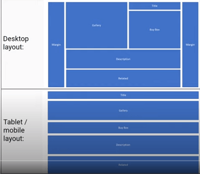

# Bootstrap 5
---


* Used for prototyping and building mobile first websites and web applications
* What's more exacting about bootstrap 5 is there is no extra jquery needed, that makes it more lighter and cleaner.

> Why should I learn bootstrap in 2020, when the CSS itself is so powerful with all the mights of css grid and flexbox ?

* Bootstrap gives non-braking, stable, reliable, mobile-first semantic code thats all get better with a development span of 8 years.
* Time is valuable, saving some of it is a good thing and bootstrap helps.
* Tested by 18million users (there are more than 18 million websites running on bootstrap.)
* Errors are fixed instantly cz of this huge community.
* You don't need everything to build from scratch, If you are planning to implement a new backend feature, then why wasting time on designing the more common elements again and again..making your html and css more junky.
* If you are working in a group, you write everything is in your own style and others may or may not be able to cop up with that but bootstrap naming and semantics are universally accepted, and also adds compatibility for screen readers and for person with disabilities.
* cross browser compatible and tested simply works on everywhere.
* Customizable, bootstrap 5 is more customizable.
* and much more if you dig deep..

> what are some of the main components available in bootstrap 5?


> What are the differences of bootstrap 5 from the earlier 4 versions?

* **Jquery isn't required anymore**(one can still use it if needed). Switch to Vanilla JavaScript
* Dropped support for **internet explorer**. (so many more new cool features can be added)
* more **minimized JS and CSS**.
* New responsive font
* Each option **available as data-attribute**, (can be set manually without js), minimizes it more.
* Enhancements in the **Grid system**.
* Enhanced **modularity**.
* **New components** /helpers/utilities/variations.
* Some **old components removed** (like **jumbotron)**.
* New **svg icon library**.

> SO BYE BYE jQuery Welcome JavaScript. (With all respect to jquery)

conclusion: As far as components are concerned, there are no major changes, however implementation changed drastically.\
New Bootstrap is much **better organized**, it's **modular and easily customizable**. And also to e**asy learn and use for new developers.**

## Installation
---

* The classic way [download](https://v5.getbootstrap.com/docs/5.0/getting-started/download/) the version from the site, as for now it is only bootstrap 5 alpha 2 is released,
* What to do with the map files? [Read this](https://css-tricks.com/should-i-use-source-maps-in-production/), explanation.
* In general,source maps are special files that connect that final output file the browser is actually using with the authored files that you actually work with and write code in on your file system.\
So, these source maps are for developers. They are particularly useful for you and your team because they help tremendously for debugging issues as well as day-to-day work. I’m sure I make use of them just about every day. I’d say in general, they are used for local development. You might even .gitignore them or skip them in a deployment process in order to serve and store fewer assets to production. But there’s been some recent chatter about making sure they go to production as well.
* link them with your html.
* Also include popper CDN from the bootstrap site too. before the bootstrap.
* Put some text in and look out for the new bootstrap font...

## Bootstrap 5 - Grid
---

* Bootstrap Grid is a tool allows user to create responsive layouts, one can use it to rearrange layout of the website depending on its screen size.
* eg. Different layouts for mobile and desktop.

  

* It uses container, row and columns.

  

* Grid breakpoints in bootstrap 5.

  

    Uses the same 12 column layout, each row can have 12 columns,
    eg: if we add `col-xxl-1 col-xl-2 col-lg-3 col-md-4 col-sm-6 col-xs-12` classes to children of one `row` container.
* on 2K, 4k, FHD screen,(xxl)

    

* On xl screen, (laptops, monitors)

    

* On l screen, (ipad pro)

    

* on md screen, (ipad, tab)

    

* on sm screen, (other small tabs)

    

* on xs screen (mobile display)

    

### Grid changes in bootstrap 5,
* `xxl` introduced.
* `.gutter` classes have been replaced with `.g`<sup>*</sup> utilities.
* form layout options now got the new grid system.
* vertical spacing classes are added.
* columns are no longer `position: relative` by default.

So what that all means check with it,

* Tip: To select all classes that contain a certain keyword, use this selector\
Here let select all the `col` classes (col-sm,md..etc) by,
```css
[class*="col"] {
  padding: 1rem;
  background-color: palegreen;
  border: 2px solid #fff;
  color: #fff;
  text-align: center;
}
```
  Which is something lke regexes that matches all the classes that starts with `col`.

* An example,
```html
<div class="container-md">
    <div class="row">
        <div class="col-sm">1</div>
        <div class="col-sm">2</div>
        <div class="col-sm">3</div>
    </div>
    <div class="row">
        <div class="col-sm">1</div>
        <div class="col-sm">2</div>
    </div>

    <div class="container">
        <div class="row">
            <div class="col-md-8">Main Content</div>
            <div class="col-md-4">Sidebar</div>
        </div>
    </div>
</div>
```
* on large screen.


### Gutter

> Refer to the html in the section.
When the gutters adjusted the spacing between the column and row changes, in y axis (`gy-5`), in x axis (`gx-3`)