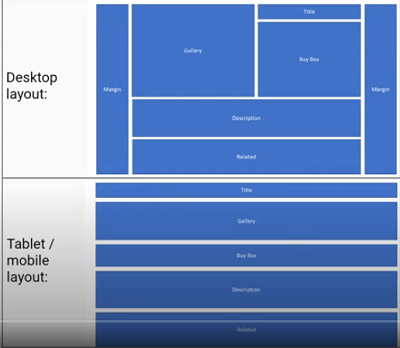
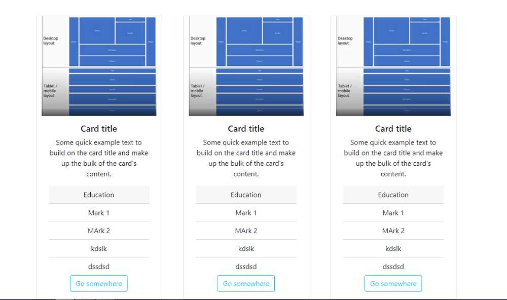

# Bootstrap 5 Cards

---

Official docs:- [Bootstrap 5 cards](https://getbootstrap.com/docs/5.0/components/card/)

## Bootstrap Cards

* Flexible and extensible content container.
* Add css intellisense extension to VScode for bootstrap class autocomplete.
* Use available card class to build up the card

Eg:-

```html
<div class="card mt-5" style="width: 18rem">
  <!-- image on top -->
  
  <div class="card-body text-center">
    <h5 class="card-title">Card title</h5>
    <p class="card-text">
      Some quick example text to build on the card title and make up the
      bulk of the card's content.
    </p>
    <div class="card-header">Education</div>
    <ul class="list-group list-group-flush">
      <li class="list-group-item">Mark 1</li>
      <li class="list-group-item">MArk 2</li>
      <li class="list-group-item">kdslk</li>
      <li class="list-group-item">dssdsd</li>
    </ul>
    <div class="text-center">
      <a href="#" class="btn btn-outline-info">Go somewhere</a>
    </div>
  </div>
</div>
```

* Use `card-group` to group multiple cards ***attached***, and maintain the same height, use `text-center` to center them horizontally.
* Use headers/ footers to automatically line up content, in groups.
* In Bv4, `card-deck`, to group multiple cards with equal width and height but with a gap ie, ***not attached***.
  In Bv5, It is done using grids. use b-5 grid classes with gap property to get the card aligned accordingly. Here `.row-cols-1` laying out the cards on one column, and `.row-cols-md-2` splitting four cards to equal width across multiple rows, from the medium breakpoint up.

  ```html
   <div class="container">
      <div class="row row-cols-1 row-cols-md-2 gap-5">
        <div class="card mt-5" style="width: 18rem">
          <!-- Card img and body -->
        </div>
        ...*3
      </div>
    </div>
  ```

  
* `card-columns` depreciated in b-5, use masonary plugin for that or customize with grid.