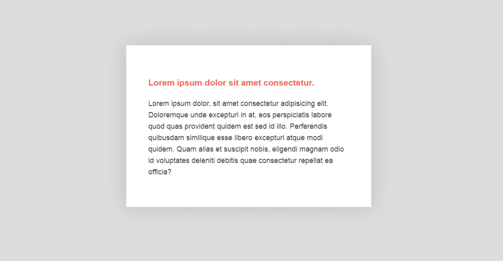
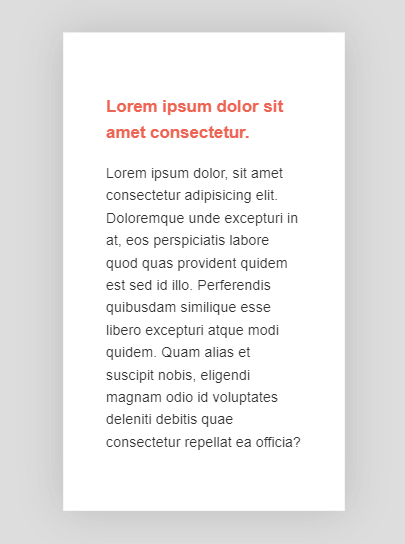
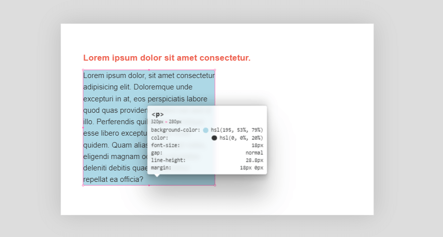

# min(), max(), clamp() font-sizes in CSS
---
Let us have a sample html and css files set like,

```html
<body>
    <div class="content">
        <div class="title">
            <h3>Lorem ipsum dolor sit amet consectetur.</h3>
        </div>
        <p>
            Lorem ipsum dolor, sit amet consectetur adipisicing elit. Doloremque unde excepturi
            in at, eos perspiciatis labore quod quas provident quidem est sed id illo.
            Perferendis quibusdam similique esse libero excepturi atque modi quidem. Quam alias
            et suscipit nobis, eligendi magnam odio id voluptates deleniti debitis quae
            consectetur repellat ea officia?
        </p>
    </div>
</body>
```

```css
:root{
    --clr-primary: #ee6352;
    --clr-body: #333;
    --clr-bg: #ddd;
}

body{
    font-family: sans-serif;
    min-height: 100vh;
    display: flex;
    justify-content: center;
    align-items: center;
    font-size: 1.125em;
    line-height: 1.6;
    color: var(--clr-body);
    background: var(--clr-bg);
}

.content{
    background: white;
    padding: 3em;
    box-shadow: 0 0 3em rgba(0, 0, 0, 0.15);

    width: 70%;
    max-width: 600px;
}

.content .title{
    margin: 0 0 .5em;
    font-weight: 900;
    color: var(--clr-primary);
}
```
It will give the following results,
<div style="width: 80%; display: flex; justify-content: space-around; align-items: center;">
    
    
</div>

* ### Using min for the adjustment
    ```css
    .content{
        background: white;
        padding: 3em;
        box-shadow: 0 0 3em rgba(0, 0, 0, 0.15);

        /* width: 70%; */
        /* max-width: 600px; */
        width: min(600px, 70%);
    }
    ```

    It also gives the same results, what happens here is, the ***min looks for the smallest value available***,
    here out of **600px** and **70%**, \
    when the screen size is larger, **600px** is minimum and it choses that one,\
    But whenever the display viewport shrinks, and the **70%** of the vp is comparatively minimum, it chooses that.\

    So simply instead of setting a `width` and `max-width` (which is equivalent) `min()`, does it more effectively in one line.
* ### Using max,
    max() does the opposite,
    ```css
    .content{
        background: white;
        padding: 3em;
        box-shadow: 0 0 3em rgba(0, 0, 0, 0.15);

        /* width: 70%; */
        /* min-width: 600px; */
        width: max(600px, 70%);
    }
    ```

    ie, when the view port is wider, it picks the **max. value**, which is **70%**,\
    also when viewport is smaller, it picks **max. value**, which is **600px**

    It is equivalent to setting a `width` and min-width.

    One can use it with as many values each one matching for a case
    ```css
    .content{
        width: max(400px, 50%, 80vh);
    }
    ```
    here what happens, it picks the maximum of this three at a time\
    lets say the vh = 640px and  it is fixed for now\
    so 80vh = 0.8 * 640 = 512px\
    512 * 2 = 1024

    for large screens, it will stick in 50%, when the vw gets less than 1024px, it gets switched to\
    80vh(512px) which is higher and stays on that,\
    lets say it is a mobile(360px x 640px) and now the user switched to landscape, now the vh becomes\
    360 and 80vh is 288px,\
    Now, 400px is the largest and the width is set to that.

    * Also can nest the max and min like,
     ```css
    .content{
        width: max(max(), 500px);
    }
    ```
    * And can use the `calc`, inside, also man
    ```css
    .content{
        width: min(500px + 20%, 1600px);
    }
    ```
    expanding little with the viewport growing.

### Using `clamp()`

  * using clamp with paragraph, clamp() always need three values to work with, a min, maximum and ideal\
  size to work with,
    ```css
    p{
        background: lightblue;
        width: clamp(200px, 50%, 20rem);
    }
    ```
    Ideally it is at 50%, but it got a threshold to keep a minimum of 200px and a maximum of 20rem (20 * 16 = 320px)\
    in between it grows, as\
    ***max, medium, minimum width*** as view port width decreases,
    <div style="width: 90%; margin: auto; display: flex; justify-content: space-around; align-items: center;">
    
    
    
    </div>

    But it is a bad option to use it for width changing, it got a very good use case of

    * ### Using clamp to change font size
    ```css
    p{
        font-size: 2vw;
    }
    ```
    There is a conventional method to bring fluidity to the font-sizes using the, `vw` units\
    But the problem with that is, when the screen gets smaller it gets too unreadable,\
    and multiple media queries contradicts the use of a responsive unit in the first place,

    Also if a person zoom in(`ctrl + scroll`) to read the small test it doesn't works, cz it depends only\
    on the `vw`.

    An alternative is to wrap a `calc` around it,
    ```css
    p{
        font-size: calc(0.5vw + 0.5rem );
    }
    ```
    now it gets better(changing) with scrolling, but the issue of small font with small screen size persists.

    The `clamp()` really helps out in this situation,\
    set the `p` font-size in clamp(),
    ```css
    .title{
        font-size: clamp(1rem, 2vw, 1.5rem);
    }
    ```
    Now for large screens the font size is *1.5rem (24px)*, for medium screens it gets *2vw( eg for 1000px - 20px)*\
    and at last settles in a minimum value of *1rem (16px)*.

## CSS units `vh`, `vw`
---
* ### viewport units affecting mobile view and responsiveness.
    * Use media queries with them always to avoid breaking.
    * Why viewport gets different from percentages, percentages always depend on the parent element.
    * viewport width always refers to the current viewport always,
* ### A practical approach
    ```css
    font-size: calc(0.5vw + 1em);
    /* in the sense of y = mx + c */
    ```