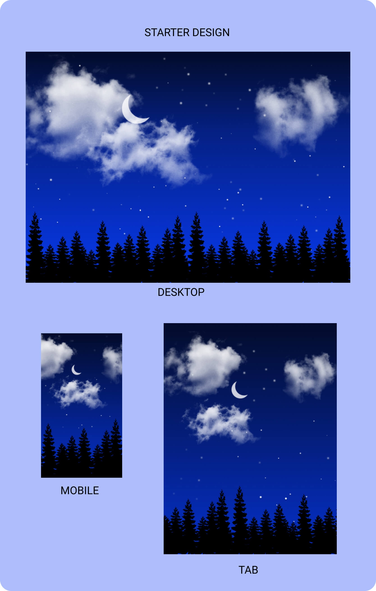

# Reusable CSS Designs
---

> ## 1. Starry Night
   ---
A starry night theme with moving clouds, using CSS and vanilla JS, it is a part of time and weather based complete theme project I'm planning.

  * ### Figma design.
    ---
    - Here is the link to sample [proto design](https://www.figma.com/file/WTfrAjPEcBDMEfZQQuthZE/Starry-Night)
    